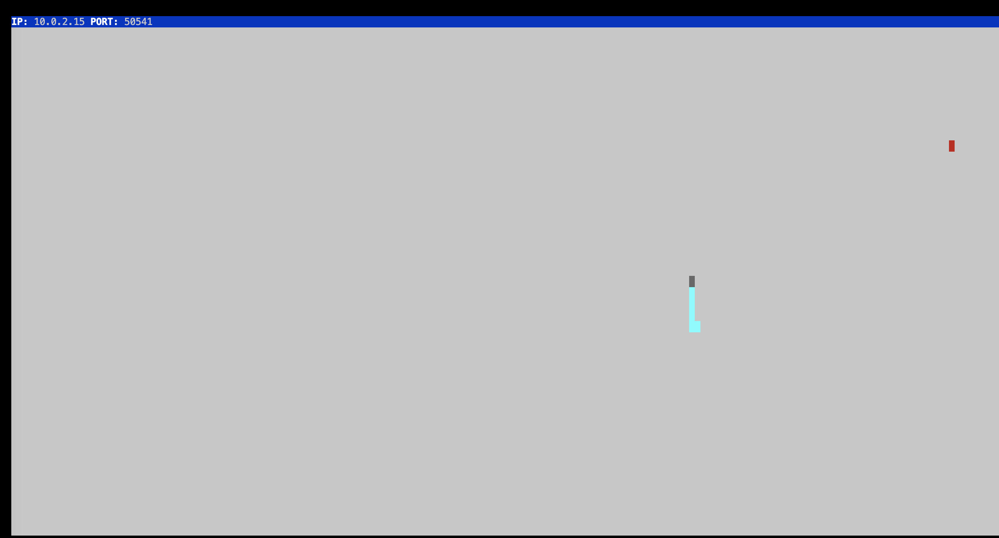
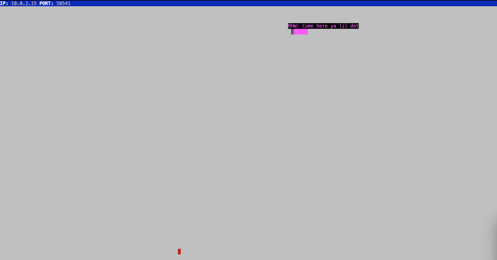

# Snake Client Project

Snake game is a very popular video game. It is a video game concept where the player maneuvers a dot and grows it by ‘eating’ pieces of food. As it moves and eats, it grows and the growing snake becomes an obstacle to smooth maneuvers. The goal is to grow it to become as big as possible without bumping into the side walls, or bumping into itself, upon which it dies.

This is simply a multiplayer take on the genre.

Before you can run this client, you will need to be running the server side which you can download and install from here. 

## Final Product

> Use the WASD keys to move your snake. 

> Use the 'c' and 'g' keys to intimidate the red dot!

## Getting Started

- Follow steps inside the snek server repo to run the server side
- From inside the snek-multiplayer directory, run `npm run play`, this will launch the gui shown above.
- Next, run the development snake client. In a new terminal window, run the `node play.js` command from within the snake-client directory.
- Your snake will appear! you can now chase down the red dot using your WASD keys. 
- To intimidate the red dot, try to use the `'g'` and `'c'` keys to shout some secret messages! 